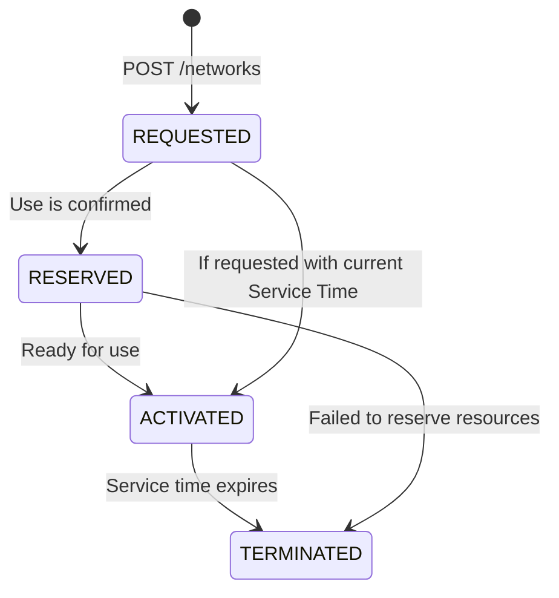

```mermaid
stateDiagram-v2
[*] --> REQUESTED: POST /networks
REQUESTED --> RESERVED: Use is confirmed
RESERVED --> ACTIVATED: Ready for use
ACTIVATED --> TERMINATED: Service time expires
REQUESTED --> ACTIVATED: If requested with current Service Time
RESERVED --> TERMINATED: Failed to reserve resources
```