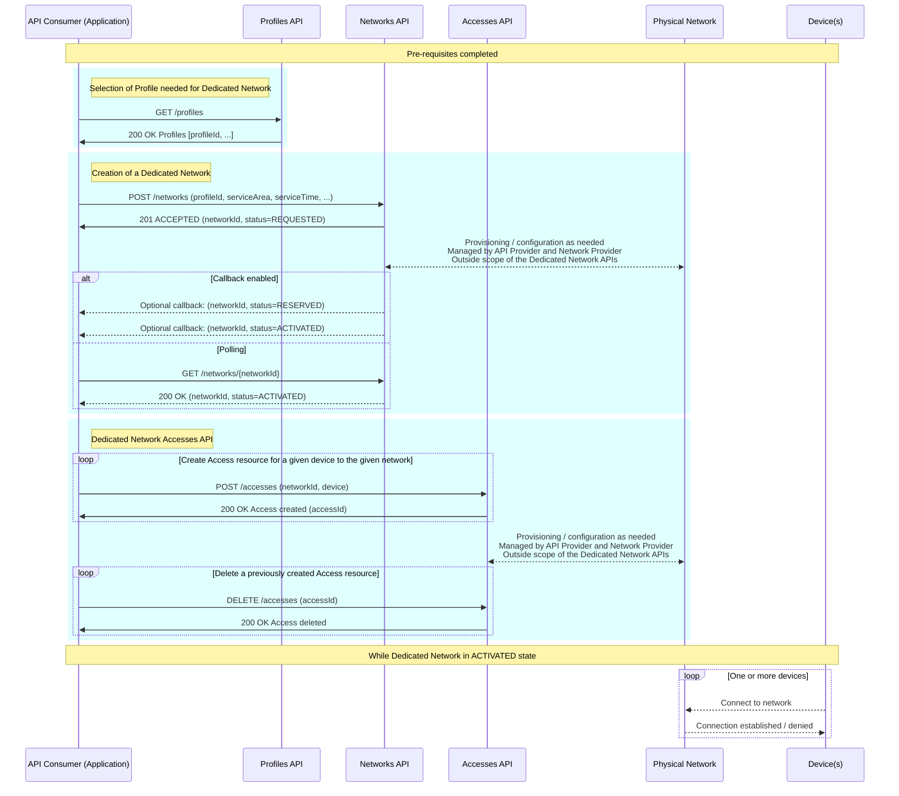

```mermaid

sequenceDiagram
    participant App as API Consumer (Application)
    participant P as Profiles API
    participant N as Networks API
    participant A as Accesses API
    participant Network as Physical Network
    participant D as Device(s)
    Note over App,D: Pre-requisites completed
    rect lightcyan
        note right of App: Selection of Profile needed for Dedicated Network
        App->>P: GET /profiles
        P->>App: 200 OK Profiles [profileId, ...]
    end
    rect lightcyan
        note right of App: Creation of a Dedicated Network
        App->>N: POST /networks (profileId, serviceArea, serviceTime, ...)
        N->>App: 201 ACCEPTED (networkId, status=REQUESTED)
         N <<-->> Network: Provisioning / configuration as needed<br> Managed by API Provider and Network Provider<br>  Outside scope of the Dedicated Network APIs
        alt Callback enabled
            N-->>App: Optional callback: (networkId, status=RESERVED)
            N-->>App: Optional callback: (networkId, status=ACTIVATED)
        else Polling
            App->>N: GET /networks/{networkId}
            N-->>App: 200 OK (networkId, status=ACTIVATED)
        end
    end
    rect lightcyan
        note right of App: Dedicated Network Accesses API
        loop Create Access resource for a given device to the given network
            App->>A: POST /accesses (networkId, device)
            A->>App: 200 OK Access created (accessId)
        end
        A <<-->> Network: Provisioning / configuration as needed<br> Managed by API Provider and Network Provider<br>  Outside scope of the Dedicated Network APIs
        loop Delete a previously created Access resource
            App->>A: DELETE /accesses (accessId)
            A->>App: 200 OK Access deleted
        end
    end
    Note over App,D: While Dedicated Network in ACTIVATED state
    loop One or more devices
        D-->>Network: Connect to network
        Network-->>D: Connection established / denied
    end
```